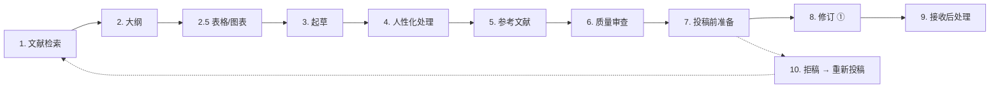
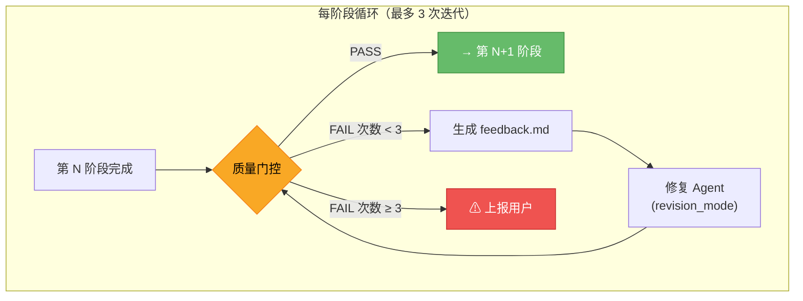
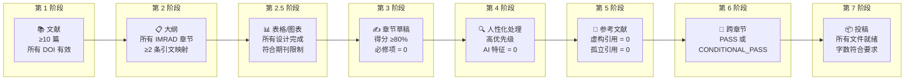
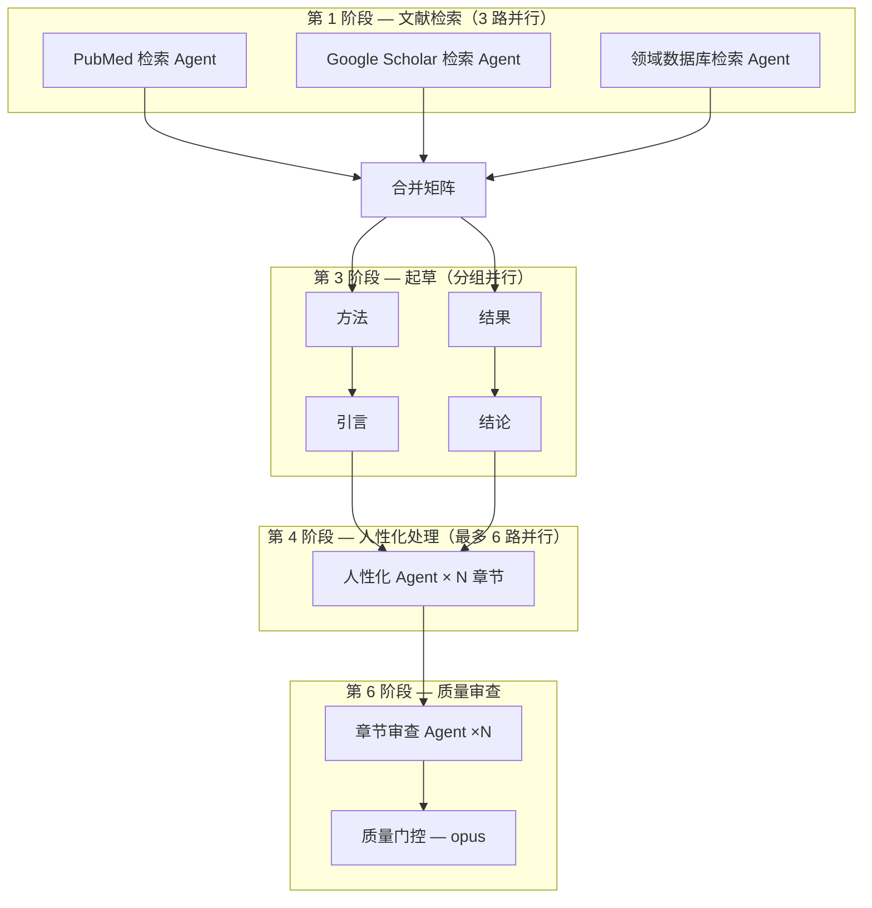

# Paper Writer Skill（论文写作技能）

用于医学/科学论文写作的 Claude Code 技能。涵盖从文献检索到投稿、同行评审响应及拒稿处理的完整稿件生命周期。

> **English version → [README.md](README.md)**
> **日本語版 → [README.ja.md](README.ja.md)**

## 概述

一个 **10 阶段**流水线，生成并管理 IMRAD 格式的项目目录，包含结构化 Markdown 文件、文献矩阵和质量检查清单。



## 架构：自主阶段门控系统（v3.1）

每个阶段均设有质量门控。若门控返回 **FAIL**，系统自动生成结构化反馈，以 `revision_mode` 调度修复 Agent 并重新检查——最多 3 次迭代，之后上报用户。只有门控返回 **PASS**，才会进入下一阶段。



### 8 个质量门控



### 团队模式：7 个并行 Agent（v3.0）

各阶段通过专业化 Agent 并行执行：



| Agent | 职责 | 模型 |
|-------|------|------|
| `paper-lit-searcher` | 特定数据库文献检索 | sonnet |
| `paper-table-figure-planner` | 表格与图表设计 | sonnet |
| `paper-section-drafter` | 章节起草（参数化） | sonnet |
| `paper-humanizer` | 去除 AI 写作特征 | haiku |
| `paper-ref-builder` | 引文收集与核查 | sonnet |
| `paper-section-reviewer` | 逐章节质量检查 | sonnet |
| `paper-quality-gate` | 跨章节一致性 + 最终裁决 | opus |

## 支持的论文类型

| 类型 | 结构 | 报告规范 |
|------|------|----------|
| **原创论文** | 完整 IMRAD | STROBE / CONSORT |
| **病例报告** | 引言 / 病例 / 讨论 | CARE |
| **综述文章** | 主题章节 | — |
| **系统综述** | 符合 PRISMA | PRISMA 2020 |
| **信件 / 简短通讯** | 精简 IMRAD | 同原创论文 |
| **研究方案** | 符合 SPIRIT | SPIRIT 2025 |

## 使用方法

### 在 Claude Code 中调用

```
/paper-writer
```

或使用自然语言触发：
- `write paper` / `start manuscript` / `research paper`
- `写论文` / `论文写作` / `撰写稿件` / `科研论文`
- `論文を書く` / `論文執筆` / `原稿作成`

### 项目设置

技能会提示您填写：

1. **工作标题**（后续可更改）
2. **论文类型**（上述 6 种类型之一）
3. **目标期刊**（可选，推荐填写）
4. **语言**（英文 / 日文 / 双语）
5. **研究问题**（一句话概括）
6. **现有数据**（已有表格/图表）

指定目标期刊后，技能会自动查询字数限制、引文格式、摘要格式及其他投稿要求。

## 生成的项目结构（v3.2）

每个论文项目会生成一个综合目录，用于管理整个研究生命周期：

```
{项目目录}/
├── README.md                        # 项目仪表盘（状态、时间线、链接）
├── 00_literature/                   # 文献检索与矩阵
├── 01_outline.md                    # 论文骨架
├── sections/                        # 稿件章节（写作顺序）
│   ├── 02_methods.md ... 08_title.md
├── tables/                          # 表格（编号）
├── figures/                         # 图表 + 图注
├── supplements/                     # 补充材料
│   ├── supplementary-tables/
│   ├── supplementary-figures/
│   └── appendices/
├── data/                            # 研究数据（原始 → 处理 → 分析）
│   ├── raw/                         # 原始数据（只读，已加入 .gitignore）
│   ├── processed/                   # 清洗、去标识化
│   ├── analysis/                    # 统计输出
│   └── data-dictionary.md
├── ethics/                          # IRB、知情同意、方案、注册
├── submissions/                     # 投稿历史（v1_bmj/、v2_lancet/ 等）
│   └── v1_{期刊}/                   # 编译后的稿件 + 投稿信 + 声明
├── revisions/                       # 修订轮次（r1/、r2/ 等）
│   └── r1/                          # 审稿意见 + 回复 + 差异对比
├── coauthor-review/                 # 共同作者反馈追踪
├── correspondence/                  # 编辑与审稿人通信日志
├── references/                      # 格式化参考文献列表
├── checklists/                      # 质量门控、报告规范追踪
└── log/                             # 决策记录、会议、时间线
```

## 文件结构

```
paper-writer/
├── SKILL.md                           # 主工作流定义
├── CHANGELOG.md                       # 版本历史
├── README.md                          # 英文文档
├── README.ja.md                       # 日文文档
├── README.zh.md                       # 中文文档（本文件）
│
├── templates/                         # 31 个文件 — 章节模板
│   ├── project-init.md                # 项目初始化（原创论文）
│   ├── project-init-case.md           # 项目初始化（病例报告）
│   ├── literature-matrix.md           # 文献对比矩阵
│   ├── methods.md                     # 方法章节写作指南
│   ├── results.md                     # 结果章节写作指南
│   ├── introduction.md                # 引言章节写作指南
│   ├── discussion.md                  # 讨论章节写作指南
│   ├── conclusion.md                  # 结论章节写作指南
│   ├── abstract.md                    # 摘要写作指南（原创论文）
│   ├── cover-letter.md                # 投稿信模板
│   ├── submission-ready.md            # 投稿前核查清单
│   ├── case-report.md                 # 病例呈现（符合 CARE）
│   ├── case-introduction.md           # 病例报告引言
│   ├── case-abstract.md               # 病例报告摘要（CARE 格式）
│   ├── review-article.md              # 综述文章结构指南
│   ├── sr-outline.md                  # 系统综述大纲
│   ├── sr-data-extraction.md          # 系统综述数据提取模板
│   ├── sr-prisma-flow.md              # PRISMA 流程图
│   ├── sr-grade.md                    # GRADE 证据评估
│   ├── sr-rob.md                      # 偏倚风险评估
│   ├── sr-prospero.md                 # PROSPERO 注册模板
│   ├── response-to-reviewers.md       # 审稿意见回复模板
│   ├── revision-cover-letter.md       # 修订版投稿信
│   ├── declarations.md                # 声明（伦理、利益冲突、资金、AI 披露）
│   ├── graphical-abstract.md          # 图形摘要指南
│   ├── title-page.md                  # 标题页模板
│   ├── highlights.md                  # 要点 / 亮点（JAMA、BMJ 等）
│   ├── limitations-guide.md           # 局限性章节指南
│   ├── acknowledgments.md             # 致谢模板
│   ├── proof-correction.md            # 接收后校样修订指南
│   ├── data-management.md             # 数据管理（原始/处理/分析）
│   └── analysis-workflow.md           # 数据分析工作流指南
│
├── references/                        # 27 个文件 — 参考资料
│   ├── imrad-guide.md                 # IMRAD 结构与写作原则
│   ├── section-checklist.md           # 逐章节质量检查清单
│   ├── citation-guide.md              # 引文格式化与管理
│   ├── citation-verification.md       # 引文核查指南
│   ├── reporting-guidelines.md        # 报告规范摘要
│   ├── reporting-guidelines-full.md   # 20+ 报告规范（含检查清单）
│   ├── humanizer-academic.md          # AI 写作检测（英文 18 种 + 日文 13 种特征）
│   ├── statistical-reporting.md       # 统计报告指南
│   ├── statistical-reporting-full.md  # 扩展 SAMPL 指南
│   ├── journal-selection.md           # 期刊选择策略
│   ├── pubmed-query-builder.md        # PubMed 检索式构建器
│   ├── multilingual-guide.md          # 多语言支持指南
│   ├── coauthor-review.md             # 共同作者审阅流程
│   ├── ai-disclosure.md               # ICMJE 2023 AI 披露指南
│   ├── tables-figures-guide.md        # 表格与图表制作指南
│   ├── keywords-guide.md              # 关键词与 MeSH 选择策略
│   ├── supplementary-materials.md     # 补充材料策略
│   ├── hook-compatibility.md          # Claude Code Hook 兼容性
│   ├── submission-portals.md          # 投稿系统指南
│   ├── open-access-guide.md           # 开放获取模式、APC、CC 许可证
│   ├── clinical-trial-registration.md # 临床试验注册指南
│   ├── abstract-formats.md            # 各期刊摘要格式
│   ├── word-count-limits.md           # 各期刊字数限制
│   ├── coi-detailed.md               # 利益冲突类别、CRediT 分类法、ORCID
│   ├── desk-rejection-prevention.md   # 预防桌面拒稿
│   ├── journal-reformatting.md        # 期刊格式转换与级联投稿策略
│   └── master-reference-list.md       # 主要参考链接（100+ 链接，13 个类别）
│
└── scripts/                           # 5 个文件 — 工具与分析
    ├── compile-manuscript.sh           # 将各章节合并为完整稿件
    ├── word-count.sh                  # 字数统计工具
    ├── forest-plot.py                 # 森林图生成器
    ├── table1.py                      # 表1生成器（基线特征）
    └── analysis-template.py           # 统计分析模板（t 检验、Logistic、生存分析）
```

**共计：66 个文件**（31 个模板 + 27 个参考资料 + 5 个脚本 + SKILL.md + CHANGELOG.md + README.md）

## 工作流程（10 个阶段）

| 阶段 | 描述 | 主要操作 |
|------|------|----------|
| **0** | 项目初始化 | 期刊要求查询、报告规范选择、目录生成、数据管理与分析 |
| **1** | 文献检索 | PubMed/Google Scholar 检索、文献矩阵创建 |
| **2** | 大纲 | 论文骨架设计（需用户确认） |
| **2.5** | 表格与图表 | 在起草正文前设计表格/图表 |
| **3** | 起草 | 方法 → 结果 → 引言 P3 + 结论 → 讨论 → 引言 P1-2 → 摘要 → 标题 |
| **4** | 人性化处理 | 去除 AI 写作特征（英文 18 种 + 日文 13 种） |
| **5** | 参考文献 | 引文格式化、去重、存在性核查 |
| **6** | 质量审查 | 跨章节核查、报告规范合规性检查 |
| **7** | 投稿前准备 | 投稿信、标题页、声明、最终核查清单 |
| **8** | 修订 | 审稿意见整理、回复信起草、修订实施 |
| **9** | 接收后处理 | 校样审读（24–72 小时）、修改提交、发表后任务 |
| **10** | 拒稿与重新投稿 | 评估、快速重新格式化、级联投稿策略 |

## 报告规范（20 种以上）

CONSORT 2025、STROBE、PRISMA 2020、CARE、STARD 2015、SQUIRE 2.0、SPIRIT 2025、TRIPOD+AI 2024、ARRIVE 2.0、CHEERS 2022、MOOSE、TREND、SRQR、COREQ、AGREE II、RECORD、STREGA、ENTREQ、PRISMA-ScR、GRADE

## 语言支持

| 语言 | 覆盖范围 |
|------|----------|
| **英文** | 所有模板和指南，18 种 AI 写作检测特征 |
| **日文** | 所有模板双语（英文/日文），13 种 AI 写作检测特征，である 体风格 |

## AI 写作检测（人性化处理）

专设第 4 阶段，用于去除学术稿件中的 AI 生成写作特征：

- **英文**：18 种特征（显著性夸大、AI 词汇、填充语等）
- **日文**：13 种特征（符号滥用、节奏单调、学术特有问题）
- 各章节的优先检测特征
- 包含修改前/后对比示例

## 主要参考链接

`references/master-reference-list.md` 包含 100+ 个 URL，分 13 个类别：

1. 作者指南（ICMJE、EQUATOR 等）
2. 报告规范（CONSORT、STROBE 等）
3. 伦理与注册（ClinicalTrials.gov、UMIN 等）
4. 统计学（SAMPL、Cochrane 等）
5. 文献数据库（PubMed、Google Scholar 等）
6. 参考文献管理器（Zotero、Mendeley 等）
7. 投稿系统（ScholarOne 等）
8. AI 披露（ICMJE、Nature 政策等）
9. 开放获取（DOAJ、Sherpa Romeo 等）
10. 写作支持（编辑服务等）
11. 图表工具（BioRender、GraphPad 等）
12. 主要期刊作者须知
13. 日文资源（医中誌、CiNii 等）

## 安装

将此仓库克隆到 Claude Code 技能目录：

```bash
git clone https://github.com/kgraph57/paper-writer-skill.git ~/.claude/skills/paper-writer
```

在 Claude Code 设置中注册技能：

```json
// 添加到 ~/.claude/settings.json 的 "skills" 中
{
  "skills": {
    "paper-writer": {
      "path": "~/.claude/skills/paper-writer"
    }
  }
}
```

## 环境要求

- [Claude Code](https://claude.ai/code) CLI
- WebSearch / WebFetch（用于文献检索）
- Python 3 + numpy、pandas、scipy、statsmodels、lifelines、matplotlib（用于数据分析脚本）

## 许可证

私有仓库。

## 版本历史

- **v3.2.0**（2026-03-05）— 研究项目目录管理：全面的目录结构重组
- **v3.1.0**（2026-03-05）— 自主阶段门控系统：8 个质量门控 + 自动修复循环
- **v3.0.0**（2026-03-05）— 团队模式：7 个并行 Agent 并发执行
- **v2.1.0**（2026-02-17）— 数据管理与分析集成，新增 4 个文件
- **v2.0.0**（2026-02-17）— 完整生命周期覆盖，新增 16 个文件，10 个阶段
- **v1.0.0**（2026-02-17）— 结构改进，新增 6 个文件，5 种论文类型

详见 [CHANGELOG.md](CHANGELOG.md)。
